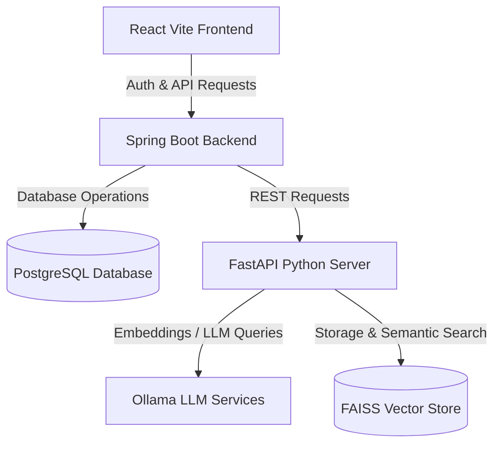

# AI-Powered Code Review and Bug Detection System

An advanced, full-stack, secure developer assistant that leverages **Retrieval-Augmented Generation (RAG)** and local Large Language Models (LLMs) to perform multi-agent code analysis, find logical bugs, detect security vulnerabilities, and recommend code quality improvements.

---

## 🚀 Key Features

* **Multi-Agent Code Analysis**: Select dedicated AI agents (Bug Detection, Security Analysis, Code Quality, and Optimization Suggestions) to review your code.
* **Local RAG Integration**: Utilizes a local vector store (**FAISS**) and embeddings (**Ollama nomic-embed-text**) to ingest and retrieve context from analyzed files.
* **Local LLM Execution**: Uses **Ollama (`qwen2.5-coder:7b`)** for running code analysis locally, ensuring complete privacy and offline usability.
* **OAuth2 Authentication**: Integrated Google OAuth2 login via Spring Security.
* **User Isolation**: Code review history and dashboard metrics are securely isolated per user based on their Google account.
* **Modern Developer Dashboard**: Interactive stats, historical activity timelines, and interactive side-by-side code diff previews.

---

## 🛠️ Architecture & Tech Stack



* **Frontend**: React (Vite), TypeScript, Tailwind CSS, shadcn/ui, Radix UI.
* **Backend API Gateway**: Spring Boot 4.x, JPA / Hibernate, Spring Security (OAuth2 Client), REST Template.
* **Database**: PostgreSQL (Store analysis logs, metrics, and user metadata).
* **AI & RAG Engine**: Python, FastAPI, LangChain, FAISS Vector Store, Ollama.

---

## 📋 Prerequisites

Before running the application, make sure you have the following installed:

1. **Java Development Kit (JDK)**: Version 17 or higher.
2. **Python**: Version 3.10 or higher (plus `pip` and `virtualenv`).
3. **PostgreSQL**: Running instance.
4. **Ollama**: Installed and running locally.
5. **Google Cloud Developer Account**: To set up OAuth2 credentials.

---

## 🔧 Installation & Setup

### 1. Database Setup
Create a database named `code_backend` in your PostgreSQL instance:
```sql
CREATE DATABASE code_backend;
```

### 2. Local LLM Setup (Ollama)
Start the Ollama application, then pull the necessary models:
```bash
# Pull the text embedding model
ollama pull nomic-embed-text

# Pull the code-specialized LLM
ollama pull qwen2.5-coder:7b
```

### 3. Python AI Backend Configuration
1. Navigate to the `LangChain RAG` directory:
   ```bash
   cd "LangChain RAG"
   ```
2. Create and activate a Python virtual environment:
   ```bash
   python -m venv .venv
   
   # On Windows (cmd/PowerShell)
   .venv\Scripts\activate
   ```
3. Install the required dependencies:
   ```bash
   pip install fastapi uvicorn pydantic langchain langchain-community langchain-ollama faiss-cpu python-dotenv
   ```
4. Create a `.env` file in the `LangChain RAG` folder:
   ```env
   # No variables required by default, but you can configure environments here if needed
   ```

### 4. Java Spring Boot Backend Configuration
1. Go to the [Google Cloud Console](https://console.cloud.google.com/).
2. Create a project and set up an **OAuth 2.0 Client ID** under **APIs & Services > Credentials**.
3. Set the **Authorized redirect URIs** to:
   `http://localhost:8080/login/oauth2/code/google`
4. Copy your Client ID and Client Secret.
5. Open `SpringBackend/src/main/resources/application.properties` and paste your credentials:
   ```properties
   spring.security.oauth2.client.registration.google.client-id=YOUR_CLIENT_ID
   spring.security.oauth2.client.registration.google.client-secret=YOUR_CLIENT_SECRET
   ```

### 5. Frontend React Configuration
1. Navigate to the `Frontend` directory:
   ```bash
   cd Frontend
   ```
2. Install npm packages:
   ```bash
   npm install
   ```

---

## 🏃 Running the Application

To run the full system, you must start the three servers simultaneously:

### Step 1: Start the Python AI Backend
From the `LangChain RAG` directory with your virtual environment active:
```bash
uvicorn Spring_Python:app --port 8000 --reload
```

### Step 2: Start the Java Spring Boot Backend
From the `SpringBackend` directory:
```bash
# Using the Maven wrapper
.\mvnw.cmd spring-boot:run
```

### Step 3: Start the Frontend React App
From the `Frontend` directory:
```bash
npm run dev
```

Open your browser and navigate to **`http://localhost:5173`** to access the system.
